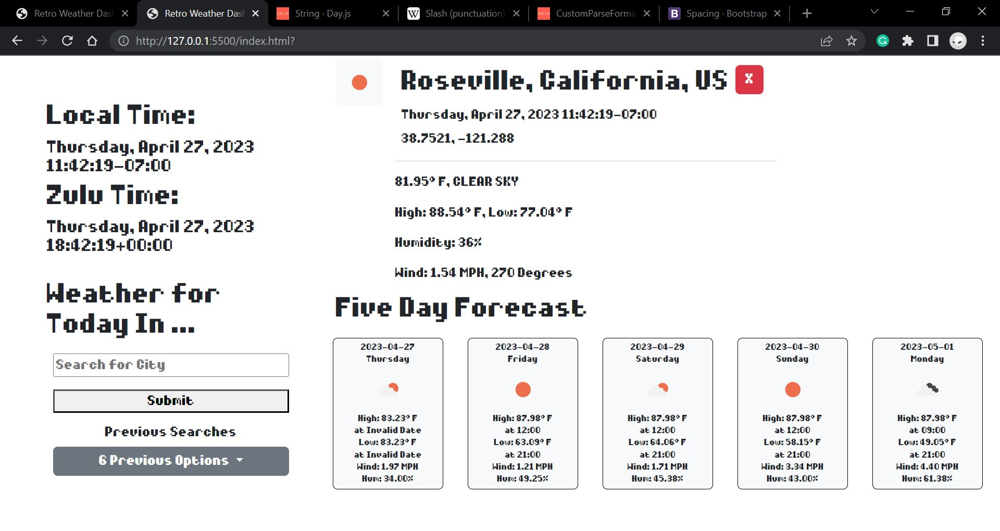

# Retro Weather Dashboard

## Description
The purpose of this assignment was to create a weather dashboard to show weather information across the globe. Using the OpenWeather API, I was able to create the dashboard. The dashboard shows the current weather, and also the weather for 5 days into the future  (all data updates every 10 minutes automatically).

All of the acceptance criteria are met, but I am happiest with the card for the current weather. I think it looks the cleanest of all of the elements I created on the page.

Hope you enjoy the product, it is meant to be viewed in full screen but mobile works to the best of my ability!

## Acceptance Criteria

```
GIVEN a weather dashboard with form inputs
WHEN I search for a city
✅ THEN I am presented with current and future conditions for that city and that city is added to the search history
WHEN I view current weather conditions for that city
✅ THEN I am presented with the city name, the date, an icon representation of weather conditions, the temperature, the humidity, and the the wind speed
WHEN I view future weather conditions for that city
✅ THEN I am presented with a 5-day forecast that displays the date, an icon representation of weather conditions, the temperature, the wind speed, and the humidity
WHEN I click on a city in the search history
✅ THEN I am again presented with current and future conditions for that city
```



## Credits
Coded by Mark Ciubal
Libraries Used: Day.js, jQuery, Bootstrap.